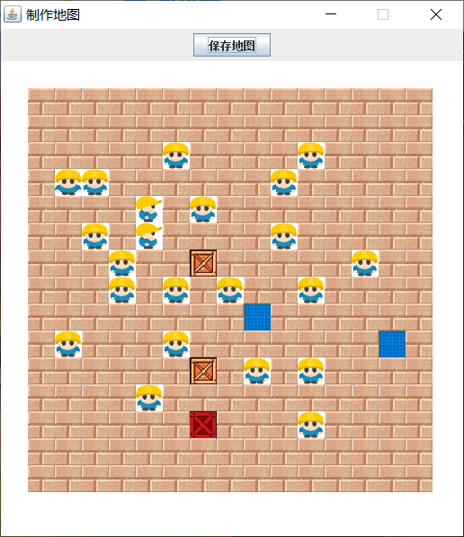
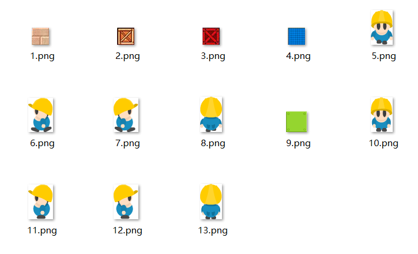

## 概述

生成二维数组游戏地图。

适用范围，如：

- [推箱子游戏](https://github.com/lcl100/PushTheBoxGame)
- [走迷宫游戏](https://github.com/lcl100/MazeGame)

## 技术栈

- JavaSE
- Swing

## 效果截图

界面效果：


点击“保存地图”按钮生成的二维数组地图如下：


点击界面范围内的图形块就会更换图像：



## 使用说明

只需要配置prop.properties配置文件中的参数项就可以了，点击`"保存地图"`就可以生成需要的二维数组地图数据文件：

```properties
# 要求在屏幕中显示的图像宽度
IMAGE_WIDTH=30
IMAGE_HEIGHT=30
# 要求在屏幕中显示的行数和列数
ROW=15
COLUMN=15
# 保存地图数据的txt文件路径
SAVE_PATH=D:\\map.txt
# 绘制地图需要用到的图片文件夹，最好配置绝对路径，不容易出错
IMAGE_DIR_PATH=F:\\images
# 初始默认显示的图像块，即图片文件夹中的文件名数字
DEFAULT_IMAGE=1
```

## 注意事项

- 图片文件夹中的图片必须以数字命名，表示在二维数组中存储的数字表示。如下：



- 图片格式只支持`.png`或`.gif`，不支持其他格式，请注意。

